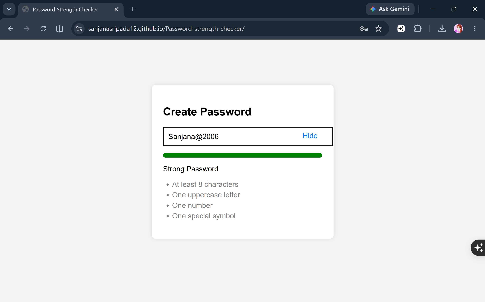

# 🔐 Password Strength Checker

A simple and interactive **Password Strength Checker** built using **HTML, CSS, and JavaScript**. This project evaluates the strength of a password in real time based on essential security criteria and provides visual feedback through a dynamic strength meter.

---

## 📌 Features

- 🔑 Real-time password strength analysis
- 👁️ Show/Hide password toggle
- 📏 Checks for minimum password length
- 🔠 Detects uppercase letters
- 🔢 Detects numeric digits
- 🔣 Detects special characters
- 📊 Dynamic password strength meter
- ✅ Live validation of password requirements
- 🎨 Clean and responsive user interface

---

## 🛠️ Technologies Used

- HTML5
- CSS3
- JavaScript (Vanilla JS)

---

## 🚀 Live Demo

🔗 **Live Demo:** https://sanjanasripada12.github.io/Password-strength-checker/

---

## 📸 Screenshots

### Dashboard



---

## 📂 Project Structure

```
Password-strength-checker/
│
├── index.html
├── style.css
├── script.js
├── Password-strength-checker.png
└── README.md
```

---

## 🚀 How to Run

1. Clone the repository

```bash
git clone https://github.com/SanjanaSripada12/Password-strength-checker.git
```

2. Open the project folder

```bash
cd Password-strength-checker
```

3. Open `index.html` in your browser.

No installation or additional libraries are required.

---

## 📖 How It Works

1. Enter a password in the input field.
2. The application checks whether the password:
   - Contains at least 8 characters
   - Includes an uppercase letter
   - Includes a number
   - Includes a special character
3. The password strength meter updates automatically.
4. The strength is displayed as:
   - Weak
   - Medium
   - Good
   - Strong
5. Use the **Show/Hide** button to toggle password visibility.

---

## 💡 Future Improvements

- 🔐 Password generator
- 📋 Copy password to clipboard
- 🌙 Dark Mode
- 📱 Improved mobile responsiveness
- 🔄 Password confirmation field
- 📈 More advanced password security checks
- 💾 Save password preferences using Local Storage


## 👩‍💻 Author

**Sanjana Sripada**

GitHub: **https://github.com/SanjanaSripada12**

---

## ⭐ Show Your Support

If you like this project, please consider giving it a ⭐ on GitHub!
